# Azure Cloud Posture Assessment

## Overview

This project documents a security assessment of a deliberately misconfigured Azure environment. I built a vulnerable environment, such as public storage, exposed network ports, over-privileged access, and incomplete logging, then used Microsoft Defender for Cloud and Azure Policy to detect, remediate, and prevent those misconfigurations. The assessment was evaluated against the CIS Microsoft Azure Foundations Benchmark v2.0.

The goal wasn't just to do simple fixes after the fact. After remediating each finding manually, I built two custom Azure Policy guardrails that block the same misconfigurations from being created again, and a CLI script that automates detection and remediation across a resource group.

## Lab Architecture

```
Azure Subscription
|
|— Resource Group — SecLab
|   |
|   |— Storage Account — seclabdata (public blob access, no HTTPS enforcement)
|   |   |— Container — important-data (anonymous read, fake sensitive files)
|   |
|   |— Virtual Machine — VM-lab1 (Ubuntu 22.04)
|   |   |— NSG — VM-lab1-nsg (SSH/RDP open to 0.0.0.0/0)
|   |
|   |— Activity Log Diagnostic Setting (partial export, Administrative only)
|
|— RBAC — duplicate Owner role assignments at subscription scope
|
|— Microsoft Defender for Cloud (Foundational CSPM)
|— Azure Policy
    |— deny-public-blob-access (Deny)
    |— deny-open-management-ports (Deny)
```

## Lab Environment

- Cloud Provider: Microsoft Azure
- Services Used: Storage Accounts, Virtual Machines, Network Security Groups, Azure Policy, Microsoft Defender for Cloud, Azure CLI
- Compliance Framework: CIS Microsoft Azure Foundations Benchmark v2.0

## Project Structure

- [Storage Account Misconfiguration](#storage-account-misconfiguration)
- [Network Security Group Misconfiguration](#network-security-group-misconfiguration)
- [Identity and Access Management](#identity-and-access-management)
- [Preventive Policy Enforcement](#preventive-policy-enforcement)
- [Remediation Automation](#remediation-automation)
- [Results](#results)
- [Key Takeaways](#Key-Takeaways)

---

## Storage Account Misconfiguration

The storage account `seclabdata` was provided with public blob access enabled and secure transfer (HTTPS enforcement) disabled. A container was set to allow anonymous read access at the blob level. Fake sensitive files, a credentials file and a CSV of employee records were uploaded to demonstrate what real-world exposure would look like.

This combination means anyone with the container URL could read these files without any authentication, and any traffic to the storage account wasn't guaranteed to be encrypted.

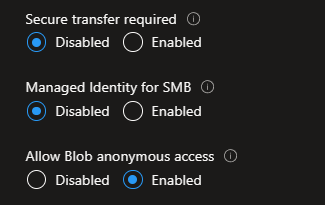
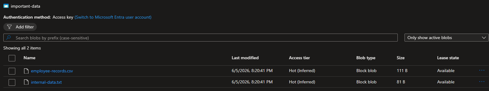

Defender for Cloud flagged this under its public access recommendation, CIS control 3.7:

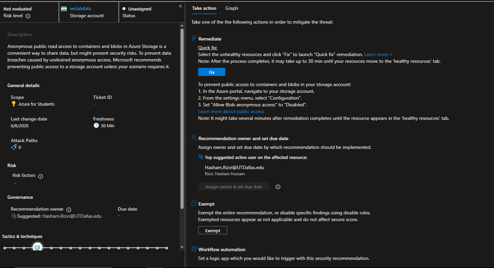

**Remediation:** Disabled blob anonymous access and enabled secure transfer through the storage account's Configuration

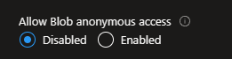


---

## Network Security Group Misconfiguration

The NSG attached to `VM-lab1` had inbound rules allowing SSH and RDP from any source. Exposed management ports are a direct target for credential brute-forcing and automated exploit scanning, and they don't require any further misconfiguration to be actively dangerous the moment the VM is reachable.

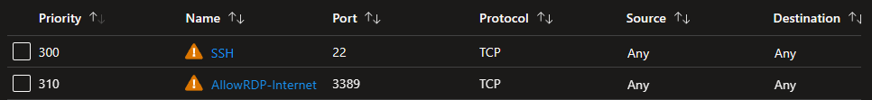

Defender for Cloud flagged this as an open management port finding:

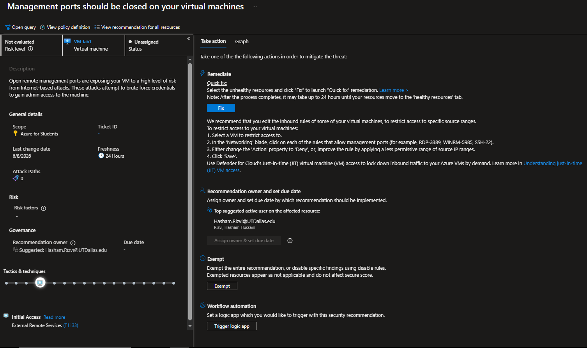

**Remediation:** Removed both rules from the network group, leaving only intra-VNet traffic and Azure Load Balancer health probes.

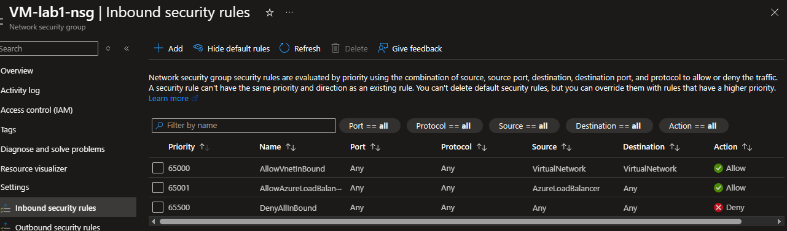

---

## Identity and Access Management

The subscription had two separate Owner role assignments tied to the same account. One was created as a standard Owner assignment, the other was configured with a highly privileged condition. This violates least-privilege principles as every account holding Owner has full control over resources with no limitations.

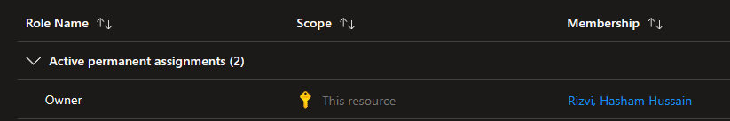

**Remediation:** Removed the duplicate assignment, leaving only one single Owner role.

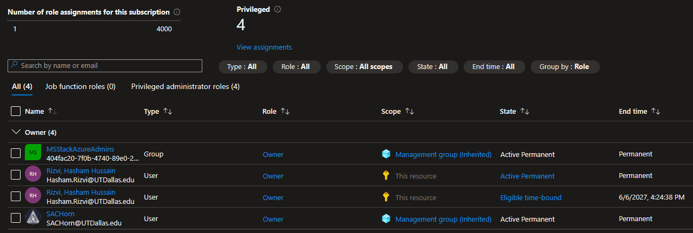

---

## Preventive Policy Enforcement

Manually remediating a fix is a temporary solution, it doesn't stop the same misconfiguration from being created again. To manage that, I set up two Azure Policy definitions with a Deny effect:

- `deny-public-blob-access` — blocks any storage account from being created or updated with public blob access enabled
- `deny-open-management-ports` — blocks any NSG rule allowing inbound SSH (22) or RDP (3389) from an unrestricted source

Both policies were tested by deliberately attempting to violate them via Azure CLI. Both attempts were rejected by Azure with `RequestDisallowedByPolicy`.

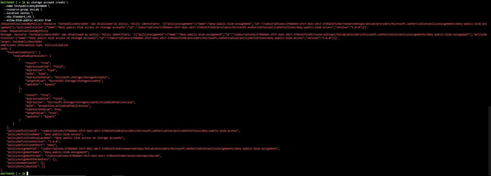
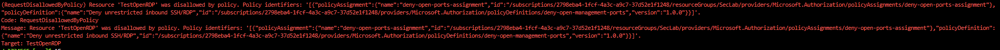

Policy definitions: [`/policies`](./policies)

---

## Remediation Automation

I wrote a CLI script (`remediate.sh`) that scans a resource group for the exact misconfiguration patterns identified in this assessment and automatically remediates them. Disabling public storage access, enforcing secure transfer, and removing open NSG management port rules. Over-privileged role assignments are flagged for manual review rather than being auto-removed, since access control changes carry risks that shouldn't be handled by an unattended script.

To validate the script independently of the Deny policy, I temporarily disabled the storage policy, reintroduced the public access misconfiguration, and ran the script against the resource group. It detected and corrected the finding without manual intervention:

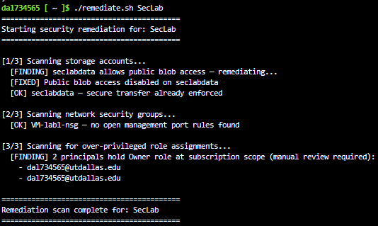

---

## Results

| Metric | Before | After |
|---|---|---|
| Secure Score | 4% | [X]% |
| High/Critical findings | [X] | [X] |
| Findings remediated | — | [X] of [X] |
| Preventive policies deployed and tested | 0 | 2 |

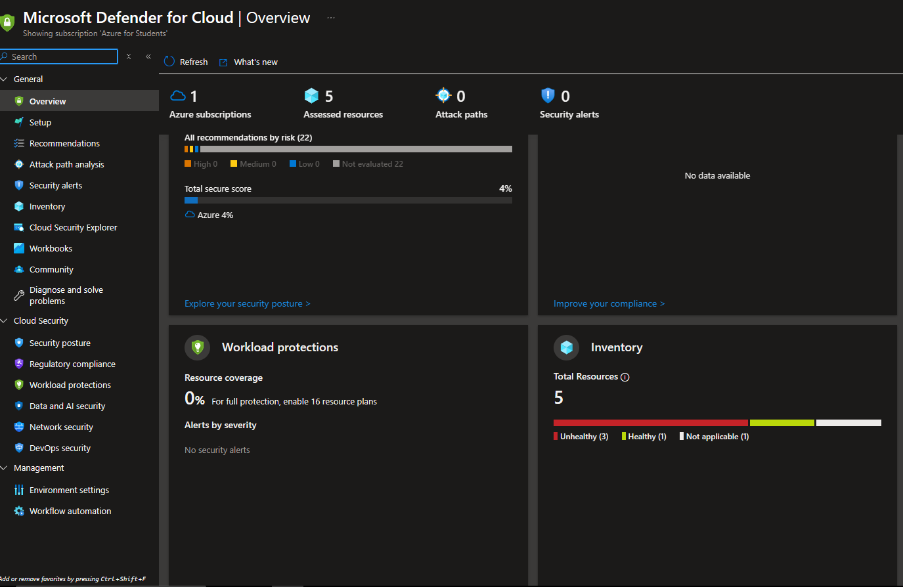
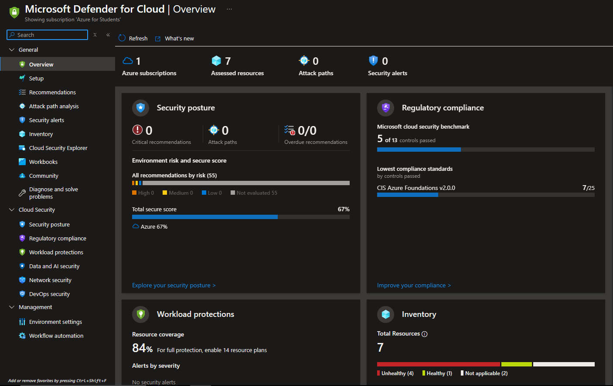

---

## Key Takeaways

Most of the findings in this assessment came from Azure's permissive defaults rather than intentional wrong decisions. Public blob access and unrestricted NSG rules can both be left in place during initial resource creation without any warning at the time. That made me want to build the Deny policies instead of just doing manual fixes because a preventive control protects future resources.

When I tried to re-trigger the storage misconfiguration with the Deny policy still active, Azure blocked my own test command, the policy was already enforcing the exact condition the script was created to catch. I had to temporarily disable the policy to actually test the script. The preventive control closed the issue before the detection layer activated, which is the order you'd want those controls to work in a real environment.

The clearest gap in this assessment was its overall scope. Azure for Students restricts operations like App Registration creation, so the service principal credential finding couldn't be assessed. I documented that limitation directly rather than completely avoiding it.
